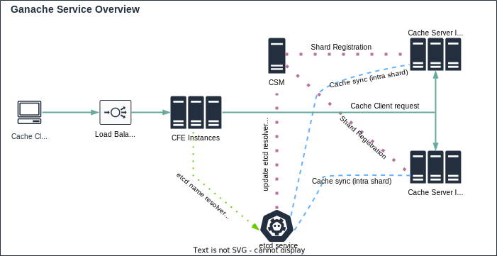

#

## Ganache

A simple, distributed, high-performant in-memory cache service.

>**NOTE: still in development, needs TLS setup.**

### Get Started

To try this out real quick:

#### Pre-reqs

1. Install etcd
2. Download the source code and compile, or download the binaries.
3. Decide how many shards to use for distributed-ness, default is `1`, i.e, no sharding.

After taking care of the pre-reqs mentioned above:

1. Start etcd
2. Start Cache Shard Manager (CSM)
   1. Dependencies
      1. etcd server (`-etcd_server` flag)
3. Start one or more Cache Servers (at least one for each shard).
   1. Dependencies
      1. etcd server (`-etcd_server` flag)
      2. CSM server (`-csm_server` flag)
      3. Shard number (`-shard` flag), starting from `0`
4. Start Cache Frontend (CFE)
   1. Dependencies
      1. Number of shards for the service (`-shards` flag), defaults to `1`
      2. etcd server (`-etcd_server` flag)
5. Use CFE API to profit (A client package will be added, hopefully soon).

### Overview

